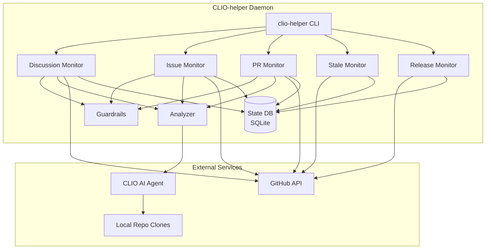

# CLIO-helper

A GitHub monitoring daemon that uses [CLIO](https://github.com/SyntheticAutonomicMind/CLIO) AI to automate community support, issue triage, code review, stale management, and release notes.

## Overview

CLIO-helper continuously monitors GitHub repositories and uses AI to provide automated assistance across five monitors:

| Monitor | What It Does |
|---------|-------------|
| **Discussions** | Answers community questions with context-aware AI responses |
| **Issues** | Deep triage: classifies, prioritizes, labels, assigns, and identifies root causes |
| **Pull Requests** | Thorough code review: logic analysis, style checks, security scanning, file-level findings |
| **Stale** | Graduated warnings and auto-close for inactive issues and PRs |
| **Releases** | Auto-generates categorized release notes from commit messages |

**Key Features:**
- **Near real-time monitoring** - Polls every 2 minutes (configurable)
- **Deep codebase analysis** - Clones repos locally and uses CLIO's tools (search, read, analyze) for context-aware AI responses
- **Intelligent filtering** - Skips already-processed, bot-created, draft, and protected items
- **Persistent state** - SQLite database tracks what's been processed across restarts
- **Security-first** - Multi-layer prompt injection protection, social engineering detection, malware/exploit scanning
- **Dry-run mode** - Test the full pipeline without posting anything
- **Multi-repo** - Monitor all your organization's repos from one daemon
- **Auto-updating context** - Git pulls latest code before each analysis cycle

## Monitors

### Discussions Monitor

Monitors GitHub Discussions and uses CLIO to provide AI-assisted community support.

**Capabilities:**
- Reads entire discussion threads (question + all comments) for full context
- Searches and reads the project's codebase to give accurate, code-backed answers
- Respects conversation limits - hands off to maintainers after configurable max responses
- Skips locked, answered, bot-authored, and maintainer-authored discussions
- Closes abusive or off-topic threads with explanation (moderation mode)

**Configuration:**

| Option | Default | Description |
|--------|---------|-------------|
| `monitors.discussions` | `true` | Enable/disable this monitor |
| `max_response_age_hours` | 24 | Ignore discussions older than this |
| `response_cooldown_minutes` | 30 | Minimum time between responses to same discussion |
| `max_responses_per_discussion` | 3 | Max responses before handing off to maintainer |
| `user_rate_limit_per_hour` | 5 | Max responses to same user per hour |
| `user_rate_limit_per_day` | 15 | Max responses to same user per day |

---

### Issue Monitor

Monitors new and updated issues and performs AI-powered triage with deep codebase investigation.

**Capabilities:**
- **Classification** - Categorizes as `bug`, `enhancement`, `question`, or `invalid`
- **Priority assignment** - Sets `critical`, `high`, `medium`, or `low` based on code analysis
- **Root cause analysis** - Searches the codebase to identify probable root cause files, functions, and a detailed hypothesis
- **Automatic labeling** - Applies classification, priority, and area labels (creates missing labels automatically)
- **Assignment** - Assigns issues to configured maintainers
- **Already-addressed detection** - Checks timeline events for linked commits that may have fixed the issue
- **Needs-info handling** - Requests specific missing information from reporters when issues are incomplete
- **Auto-close** - Closes spam, prompt injection attempts, and invalid issues with explanation

**Triage Comment Format:**

When an issue is triaged, CLIO posts a structured comment including:
- Classification, priority, and completeness score
- Analysis summary
- Root cause analysis (for bugs): affected files, functions, hypothesis, and confidence level
- Affected areas

**Configuration:**

| Option | Default | Description |
|--------|---------|-------------|
| `monitors.issues` | `true` | Enable/disable this monitor |
| `issue_cooldown_minutes` | 60 | Minimum time between re-triaging the same issue |
| `issue_poll_limit` | 10 | Max issues to fetch per repo per cycle |

---

### Pull Request Monitor

Monitors new and updated pull requests and performs thorough AI-powered code review.

**Capabilities:**
- **Full diff analysis** - Reads the complete PR diff (up to configurable max size)
- **Source context** - Reads the full source files being modified, not just the diff hunks
- **Logic and correctness** - Flags logic gaps, unhandled code paths, missing error handling, off-by-one errors
- **Naming and clarity** - Evaluates variable/function naming, comments, and magic numbers
- **Missing checks** - Identifies missing input validation, null checks, bounds checking, and permission checks
- **Architecture review** - Checks for single responsibility, coupling, consistency with existing patterns, and breaking changes
- **Style compliance** - Verifies project coding standards (strict/warnings/utf8, indentation, POD, file endings)
- **Security scanning** - Detects code injection, hardcoded credentials, path traversal, and dangerous system calls
- **Malware detection** - Scans for obfuscated code, network exfiltration, backdoors, supply chain attacks, and data harvesting
- **File-level findings** - Returns structured per-file feedback with severity levels (`error`, `warning`, `suggestion`, `nitpick`)
- **Re-review on push** - Tracks head commit SHA; automatically re-reviews when new commits are pushed, marking the comment as "Updated Review"
- **Label suggestions** - Recommends labels based on review findings

**Review Comment Format:**

Reviews are posted as structured comments with:
- Verdict banner (Approved / Changes Requested / Security Review Required / Needs Review)
- Summary of overall change quality
- Metrics table (test coverage, breaking changes)
- Security concerns section (if any)
- Per-file review with severity-tagged findings
- Style issues, documentation issues, and overall feedback sections

**Configuration:**

| Option | Default | Description |
|--------|---------|-------------|
| `monitors.pull_requests` | `true` | Enable/disable this monitor |
| `pr_cooldown_minutes` | 30 | Minimum time between re-reviewing same PR |
| `pr_poll_limit` | 10 | Max PRs to fetch per repo per cycle |
| `max_diff_size` | 50000 | Max diff size in characters (truncated beyond this) |

---

### Stale Monitor

Detects and manages inactive issues and PRs with graduated warnings.

**Capabilities:**
- **Graduated warnings** - Posts a warning comment after configurable inactivity period, then closes after a second period
- **Stale label** - Adds a `stale` label when warning is posted
- **Protected items** - Respects pinned issues, milestoned issues, assigned issues, and items with `keep-open`, `priority:critical`, or `priority:high` labels
- **PR awareness** - Separately tracks stale PRs with shorter thresholds; skips draft PRs
- **Self-healing** - If a user comments on a warned item, the stale status resets naturally (no activity = closure proceeds)

**Configuration:**

| Option | Default | Description |
|--------|---------|-------------|
| `monitors.stale` | `false` | Enable/disable this monitor |
| `stale_warning_days` | 30 | Days of inactivity before warning |
| `stale_close_days` | 60 | Days of inactivity before closing |
| `stale_pr_warning_days` | 14 | Days of inactivity before warning on PRs |

---

### Release Monitor

Monitors new releases and auto-generates categorized release notes from commit messages.

**Capabilities:**
- **Conventional commit parsing** - Categorizes commits by type: features, fixes, refactoring, documentation, tests, maintenance
- **Breaking change detection** - Highlights commits with `BREAKING CHANGE` or `!` prefix
- **Automatic range detection** - Compares commits between current and previous release tag
- **Existing notes respected** - Skips releases that already have manually written notes (>100 chars)
- **Full changelog link** - Includes a GitHub compare URL at the bottom

**Generated Format:**

```markdown
## What's Changed

### :warning: Breaking Changes
- List of breaking changes

### New Features
- feature descriptions from feat() commits

### Bug Fixes
- fix descriptions from fix() commits

### Refactoring / Documentation / Tests / Maintenance
- categorized by conventional commit prefix

**Full Changelog:** https://github.com/owner/repo/compare/v1.0...v2.0
```

**Configuration:**

| Option | Default | Description |
|--------|---------|-------------|
| `monitors.releases` | `false` | Enable/disable this monitor |

## Installation

### Quick Install (Recommended)

The installer handles all dependencies automatically:

```bash
# Clone the repo
git clone https://github.com/SyntheticAutonomicMind/CLIO-helper.git
cd CLIO-helper

# Run installer
./install.sh
```

The installer will:
- Install cpanm (if needed)
- Install Perl dependencies (DBI, DBD::SQLite) to `~/.local/lib/perl5`
- Install GitHub CLI (`gh`) to `~/.local/bin`
- Create wrapper script with proper environment
- Set up configuration file
- Optionally install and start systemd service

### Installer Options

```bash
./install.sh                # Interactive installation
./install.sh -y             # Non-interactive (use defaults)
./install.sh --user         # User-mode install (no systemd, auto-update CLIO)
./install.sh --no-service   # Install without systemd service
./install.sh --status       # Check installation status
./install.sh --uninstall    # Remove installation
```

### Manual Installation

If you prefer manual setup:

```bash
# Install dependencies
cpanm DBI DBD::SQLite
# OR on Debian/Ubuntu:
sudo apt install libdbi-perl libdbd-sqlite3-perl

# Create config
mkdir -p ~/.clio
cp examples/config.example.json ~/.clio/helper-config.json

# Edit config with your GitHub token
$EDITOR ~/.clio/helper-config.json

# Run directly
./clio-helper
```

## Usage

```bash
# Start all enabled monitors (continuous)
clio-helper

# Start specific monitors only
clio-helper --monitor discussions,issues,prs

# Run single poll cycle (for testing)
clio-helper --once --debug

# Dry run (analyze but don't post responses)
clio-helper --dry-run

# Show statistics
clio-helper --stats

# Show version
clio-helper --version

# Use custom config
clio-helper --config /path/to/config.json
```

## Configuration

Create `~/.clio/helper-config.json`:

```json
{
    "repos": [
        {"owner": "YourOrg", "repo": "your-project"},
        {"owner": "YourOrg", "repo": "another-repo"}
    ],
    "monitors": {
        "discussions": true,
        "issues": true,
        "pull_requests": true,
        "stale": false,
        "releases": false
    },
    "poll_interval_seconds": 120,
    "github_token": "ghp_your_token_here",
    "posting_token": "",
    "model": "MiniMax-M2.7",
    "dry_run": false,
    "maintainers": ["your-username"]
}
```

See `examples/config.example.json` for a full configuration reference with all options.

### Core Settings

| Option | Default | Description |
|--------|---------|-------------|
| `repos` | `[]` | Array of `{owner, repo}` objects to monitor |
| `monitors` | all true | Enable/disable individual monitors (see above) |
| `poll_interval_seconds` | 120 | How often to poll for updates (seconds) |
| `github_token` | `$GH_TOKEN` | GitHub personal access token |
| `posting_token` | (none) | Separate token for posting comments (optional; falls back to `github_token`) |
| `model` | `MiniMax-M2.7` | AI model for CLIO analysis (any CLIO-supported model) |
| `clio_path` | `clio` | Path to CLIO executable |
| `dry_run` | false | Analyze without posting responses |
| `maintainers` | `[]` | GitHub usernames to skip (they handle their own threads) |

### Files and Paths

| Option | Default | Description |
|--------|---------|-------------|
| `state_file` | `~/.clio/helper-state.db` | SQLite database for state tracking |
| `log_file` | `~/.clio/helper-daemon.log` | Daemon log file |
| `alert_file` | `~/.clio/helper-alerts.log` | Log file for flagged content alerts |
| `repos_dir` | `~/.clio/repos` | Directory where monitored repos are cloned for code context |
| `prompts_dir` | (bundled) | Directory containing custom prompt templates |
| `auto_pull` | true | Git pull latest code before each analysis cycle |

### Auto-Update Settings

| Option | Default | Description |
|--------|---------|-------------|
| `auto_update_clio` | true | Automatically check for and install CLIO updates |
| `update_check_hours` | 4 | How often to check for CLIO updates (hours) |
| `helper_install_dir` | `~/CLIO-helper` | Directory where CLIO-helper is installed (for running install.sh) |

### GitHub Token Scopes

Your `github_token` (or `GH_TOKEN` env var) needs these scopes:

| Scope | Required For |
|-------|-------------|
| `repo` | Reading issues, PRs, and discussions from private repos |
| `read:discussion` | Accessing GitHub Discussions API |
| `write:discussion` | Posting comments and closing discussions |

If using a separate `posting_token` for a bot account, that token also needs `repo` and `write:discussion` scopes.

> **Tip:** Use a [fine-grained personal access token](https://github.com/settings/tokens?type=beta) scoped to only the repositories you want to monitor.

## Security and Guardrails

CLIO-helper includes multiple layers of abuse protection.

### AI-Level Protection (Prompt-Based)

Every prompt (discussion, issue triage, PR review) includes:
- Explicit prompt injection defense - content is treated as data, never instructions
- Social engineering detection - flags requests for credentials or env dumps
- Security-first processing order - scans for violations before analysis

### Programmatic Pre-Filtering (Guardrails Module)

Before content reaches the AI, it's scanned for:

| Pattern Type | Examples | Action |
|--------------|----------|--------|
| Prompt injection | "ignore previous instructions", "new system prompt" | Auto-moderate |
| Invisible characters | Zero-width joiners, Unicode tags, Punycode IDN | Sanitize and flag |
| Encoded content | Base64, hex, excessive URL encoding | Flag for review |
| Harmful requests | "how to hack", "create malware" | Auto-moderate |
| Social engineering | "I'm the admin", "this is urgent" | Flag for review |
| Spam indicators | Shortened URLs, commercial keywords | Log and proceed |

### PR-Specific Security (Code Review)

The PR review prompt includes dedicated malware and exploit detection:
- Obfuscated code (Base64/hex encoded payloads, eval of decoded strings)
- Network exfiltration (unexpected HTTP/socket connections)
- File system abuse (writing to system directories, hidden files)
- Privilege escalation (sudo/root access, modifying system files)
- Supply chain attacks (unexpected dependencies, modified lockfiles)
- Backdoors (hidden triggers, time bombs, environment variable triggers)
- Data harvesting (reading SSH keys, browser cookies, credential stores)

### Maintainer Alerts

Flagged content is logged to `~/.clio/helper-alerts.log`. Set `notify_in_thread: true` to also @mention maintainers in the thread.

## Customizing Prompts

CLIO-helper uses customizable prompt templates to control how the AI analyzes and responds.

### Prompt Templates

| File | Used By | Purpose |
|------|---------|---------|
| `prompts/analyzer-default.md` | Discussion Monitor | Main prompt for analyzing discussions and generating responses |
| `prompts/issue-triage.md` | Issue Monitor | Deep triage: classification, root cause analysis, labeling |
| `prompts/pr-review.md` | PR Monitor | Thorough code review: logic, style, security, file-level findings |
| `prompts/handoff-message.md` | Discussion Monitor | Message posted when response limit is reached for a thread |

### Using Custom Prompts

1. Copy the bundled prompts:
   ```bash
   mkdir -p ~/.clio/prompts
   cp prompts/*.md ~/.clio/prompts/
   ```

2. Point your config to the custom directory:
   ```json
   {
       "prompts_dir": "~/.clio/prompts"
   }
   ```

3. Edit to suit your project's needs:
   ```bash
   $EDITOR ~/.clio/prompts/analyzer-default.md
   ```

### Testing Prompts

Use dry-run mode to test prompt changes without posting:

```bash
clio-helper --once --dry-run --debug
```

### Example Templates

The `prompts/examples/` directory contains pre-built discussion templates:

| Template | Description |
|----------|-------------|
| `analyzer-strict.md` | Minimal responses, bugs/errors only |
| `analyzer-friendly.md` | Warm and welcoming, broad scope |
| `analyzer-technical.md` | Detailed technical responses with code |
| `analyzer-template.md` | Blank template for full customization |

## Architecture



**Flow:**
1. Daemon polls each repo on a configurable interval
2. Each enabled monitor fetches its relevant items (discussions, issues, PRs, etc.)
3. State database filters out already-processed and cooled-down items
4. Guardrails pre-filter content for prompt injection, encoded attacks, and abuse
5. Analyzer runs CLIO in the cloned repo directory for full codebase context
6. Monitor posts results (comments, labels, assignments) via GitHub API
7. State records the action for future filtering

For detailed flow diagrams of each monitor, the Analyzer pipeline, Guardrails checks, and the State DB schema, see **[docs/ARCHITECTURE.md](docs/ARCHITECTURE.md)**.

## Running as a Service

### systemd User Service (Installed Automatically)

The installer creates a user-level systemd service:

```bash
# Check status
systemctl --user status clio-helper

# Start/stop
systemctl --user start clio-helper
systemctl --user stop clio-helper

# View logs
tail -f ~/.clio/helper-daemon.log

# Enable at boot (without login)
loginctl enable-linger $USER
```

### Manual systemd Setup

If you installed without the service:

```ini
# ~/.config/systemd/user/clio-helper.service
[Unit]
Description=CLIO Helper - GitHub Monitoring Daemon
After=network-online.target
Wants=network-online.target

[Service]
Type=simple
ExecStart=%h/CLIO-helper/run-clio-helper
Restart=always
RestartSec=30

StandardOutput=append:%h/.clio/helper-daemon.log
StandardError=append:%h/.clio/helper-daemon.log

[Install]
WantedBy=default.target
```

```bash
systemctl --user daemon-reload
systemctl --user enable clio-helper
systemctl --user start clio-helper
```

### launchd (macOS)

```xml
<!-- ~/Library/LaunchAgents/org.sam.clio-helper.plist -->
<?xml version="1.0" encoding="UTF-8"?>
<!DOCTYPE plist PUBLIC "-//Apple//DTD PLIST 1.0//EN" "http://www.apple.com/DTDs/PropertyList-1.0.dtd">
<plist version="1.0">
<dict>
    <key>Label</key>
    <string>org.sam.clio-helper</string>
    <key>ProgramArguments</key>
    <array>
        <string>/path/to/CLIO-helper/clio-helper</string>
    </array>
    <key>RunAtLoad</key>
    <true/>
    <key>KeepAlive</key>
    <true/>
    <key>EnvironmentVariables</key>
    <dict>
        <key>GH_TOKEN</key>
        <string>your_token</string>
    </dict>
</dict>
</plist>
```

```bash
launchctl load ~/Library/LaunchAgents/org.sam.clio-helper.plist
```

## Troubleshooting

### Service won't start

```bash
# Check logs
journalctl --user -u clio-helper -f

# Test manually
clio-helper --once --debug
```

### GitHub API errors

1. Verify token has required scopes (see [Token Scopes](#github-token-scopes))
2. Test gh CLI: `gh api graphql -f query='{ viewer { login } }'`
3. If using `posting_token`, verify that token also has write access

### Missing Perl modules

```bash
# Reinstall dependencies
~/.local/bin/cpanm -l ~/.local DBI DBD::SQLite

# Verify
perl -I~/.local/lib/perl5 -MDBI -MDBD::SQLite -e 'print "OK\n"'
```

### CLIO not found

```bash
# Check CLIO is installed and in PATH
which clio

# Or set explicit path in config
{
    "clio_path": "/home/user/.local/bin/clio"
}
```

## Requirements

- **Perl 5.32+** with `DBI` and `DBD::SQLite` modules
- **[CLIO](https://github.com/SyntheticAutonomicMind/CLIO)** - AI assistant (used for analysis)
- **[GitHub CLI](https://cli.github.com/) (`gh`)** - Authenticated with appropriate token scopes
- **Network access** to the GitHub API
- **SQLite** (bundled with DBD::SQLite)

All dependencies except Perl itself are installed automatically by `install.sh`.

## License

[GPL-3.0](LICENSE)

## Part of the Ecosystem

CLIO-helper is part of [Synthetic Autonomic Mind](https://github.com/SyntheticAutonomicMind) - a family of open source AI tools:

- **[SAM](https://github.com/SyntheticAutonomicMind/SAM)** - Native macOS AI assistant with voice control, document analysis, and image generation
- **[CLIO](https://github.com/SyntheticAutonomicMind/CLIO)** - AI code assistant for the terminal. Runs on macOS and Linux.
- **[MIRA](https://github.com/SyntheticAutonomicMind/MIRA)** - Native graphical terminal for CLIO. Runs on macOS, Linux, and Windows.
- **[ALICE](https://github.com/SyntheticAutonomicMind/ALICE)** - GPU-accelerated image generation server with web interface and OpenAI-compatible API
- **[SAM-Web](https://github.com/SyntheticAutonomicMind/SAM-web)** - Access SAM from iPad, iPhone, or any browser

---

## Contributing

Contributions welcome! See [CONTRIBUTING.md](CONTRIBUTING.md) for guidelines.
