# CLIO-helper Architecture

This document describes the architecture, data flows, and design decisions for CLIO-helper.

## System Overview

CLIO-helper is a polling daemon that monitors GitHub repositories and uses CLIO AI for automated analysis. It runs as a systemd user service (or launchd on macOS) and communicates with GitHub via the `gh` CLI.

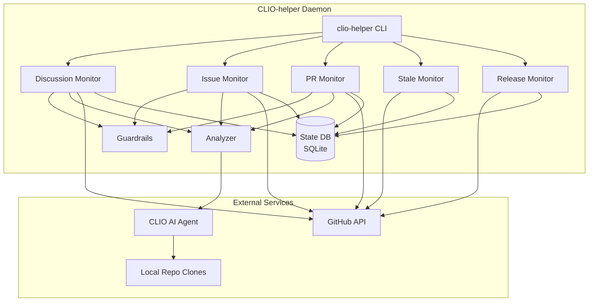

## Main Daemon Loop

The daemon runs a continuous poll cycle. Each iteration checks all enabled monitors, sleeps for the configured interval, then repeats.

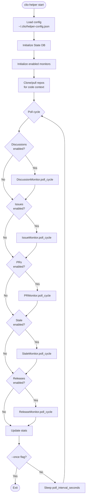

## Discussion Monitor Flow

The Discussion Monitor handles community Q&A in GitHub Discussions.

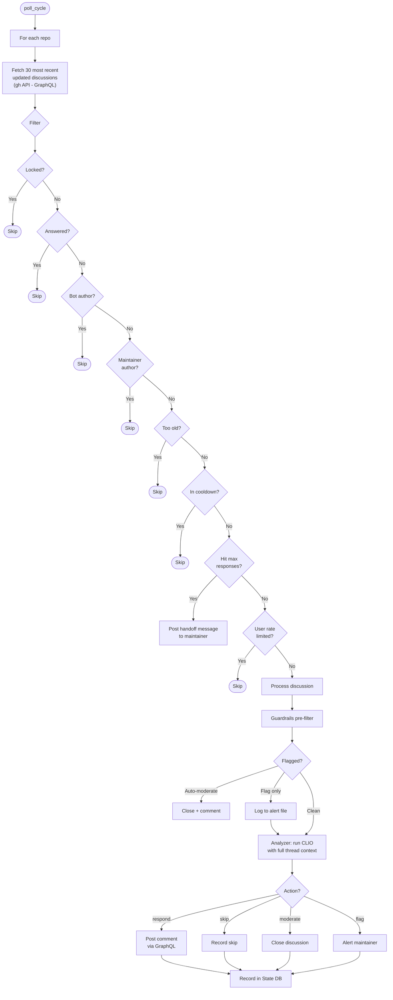

## Issue Triage Flow

The Issue Monitor performs deep codebase investigation for root cause analysis.

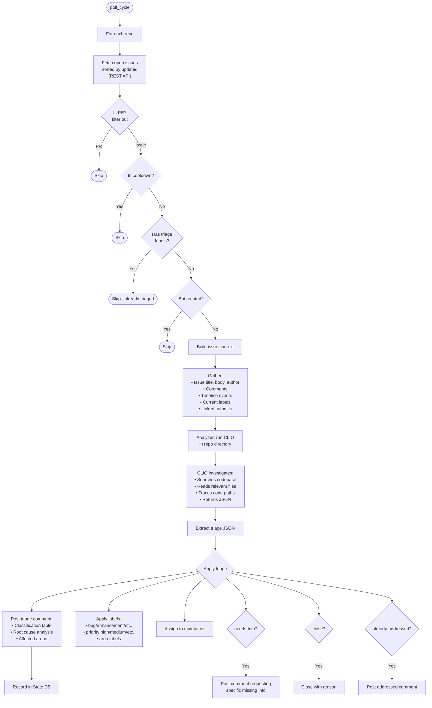

## Pull Request Review Flow

The PR Monitor performs thorough code review with full source context.

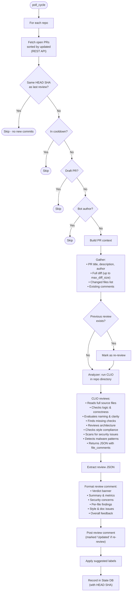

## Stale Management Flow

The Stale Monitor uses graduated warnings before closing inactive items.

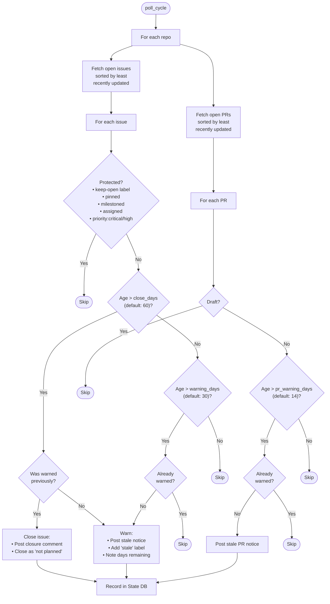

## Release Notes Flow

The Release Monitor generates categorized changelogs from conventional commits.

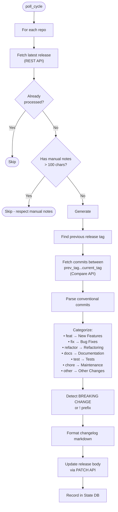

## Analyzer Pipeline

The Analyzer is the bridge between monitors and CLIO AI. It handles prompt construction, CLIO execution, and response parsing.

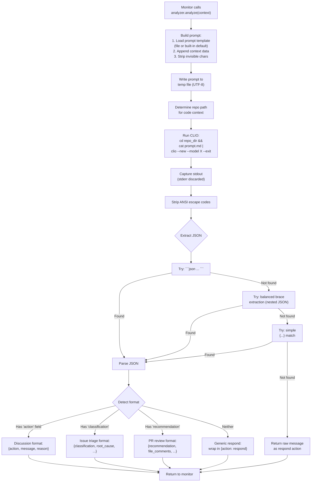

## Guardrails Pipeline

Content safety checks run before AI analysis for discussions.

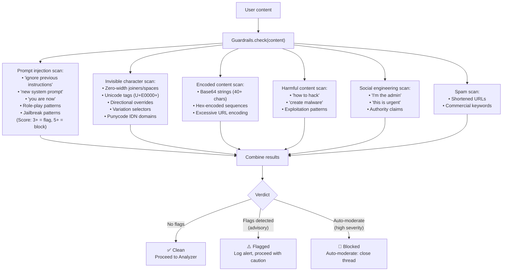

## State Database Schema

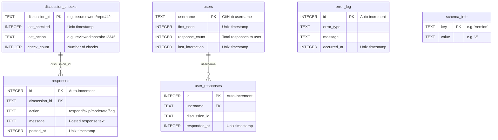

**ID Conventions:**
- Discussions: `disc:owner/repo#number`
- Issues: `issue:owner/repo#number`
- Pull Requests: `pr:owner/repo#number`
- Stale items: `stale:owner/repo#number` or `stale:owner/repo#prN`
- Releases: `release:owner/repo:tag`

## Module Dependency Graph

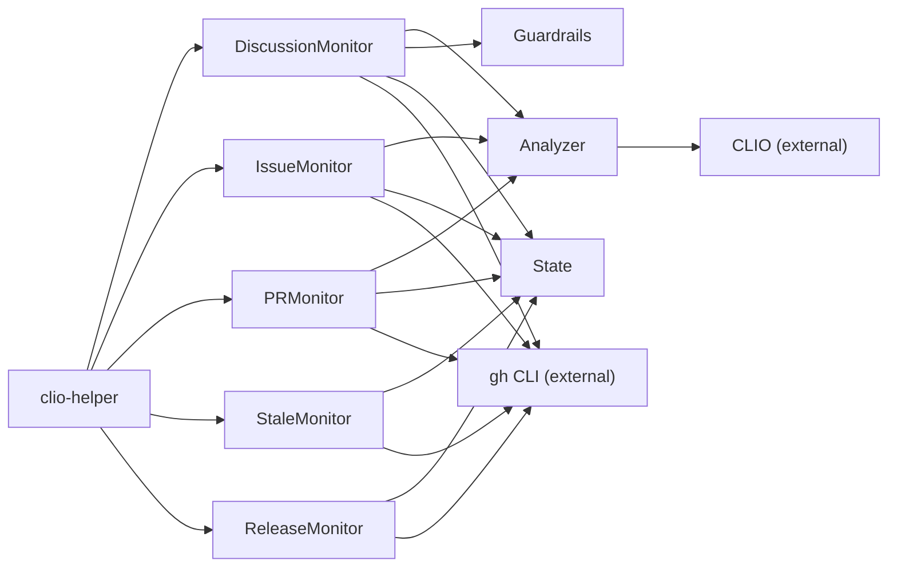

## Deployment

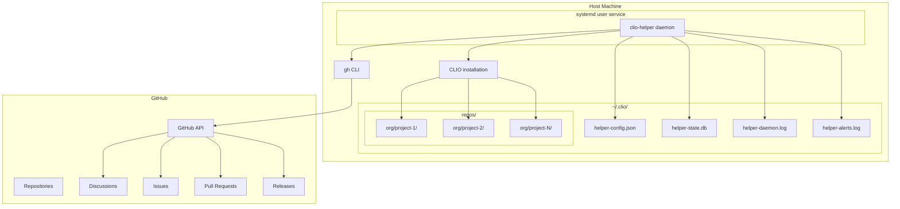

## Design Decisions

### Why CLIO instead of direct API calls?

CLIO provides tool-calling capabilities (file search, file read, semantic search) that allow the AI to investigate the codebase during analysis. A direct API call would only see the prompt text - CLIO can actually explore the code.

### Why `gh` CLI instead of raw HTTP?

The `gh` CLI handles authentication, pagination, and GraphQL complexity. It's a well-maintained tool that simplifies GitHub API interactions significantly, especially for the Discussions GraphQL API which requires complex query construction.

### Why SQLite for state?

- Zero configuration (no server to run)
- Atomic writes (no corruption on crash)
- Single file (easy to backup/inspect)
- Concurrent reads (daemon is single-threaded, but safe if queried externally)
- Built-in to Perl via DBD::SQLite

### Why poll instead of webhooks?

- No inbound network requirements (works behind NAT/firewall)
- No public endpoint to secure
- Simpler deployment (just a service, no web server)
- Resilient to missed events (polls catch everything, webhooks can miss)
- Configurable frequency (can run less often to save API quota)

### Why separate posting_token?

Allows using a bot account for posting comments while using a personal token for reading. This provides clearer attribution (comments come from "clio-bot" not your personal account) and allows different permission scopes.
